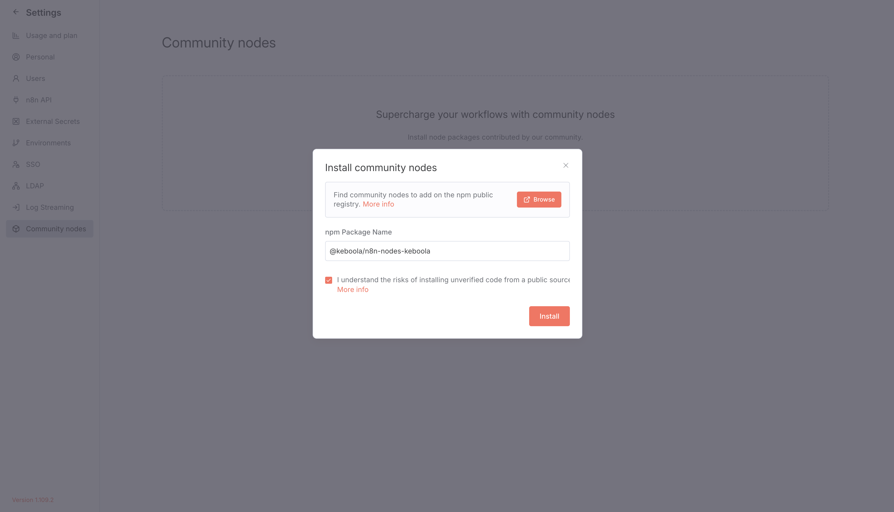
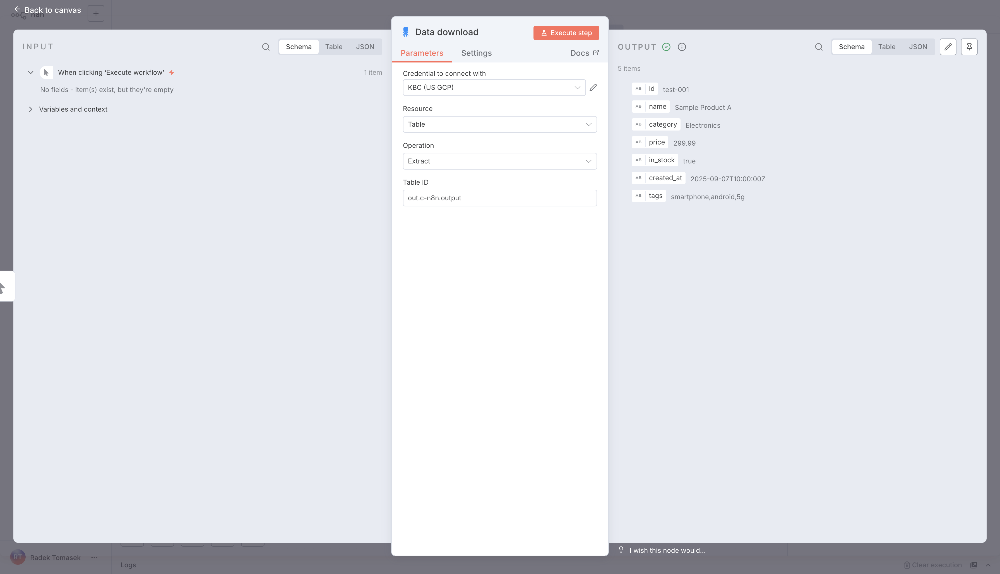
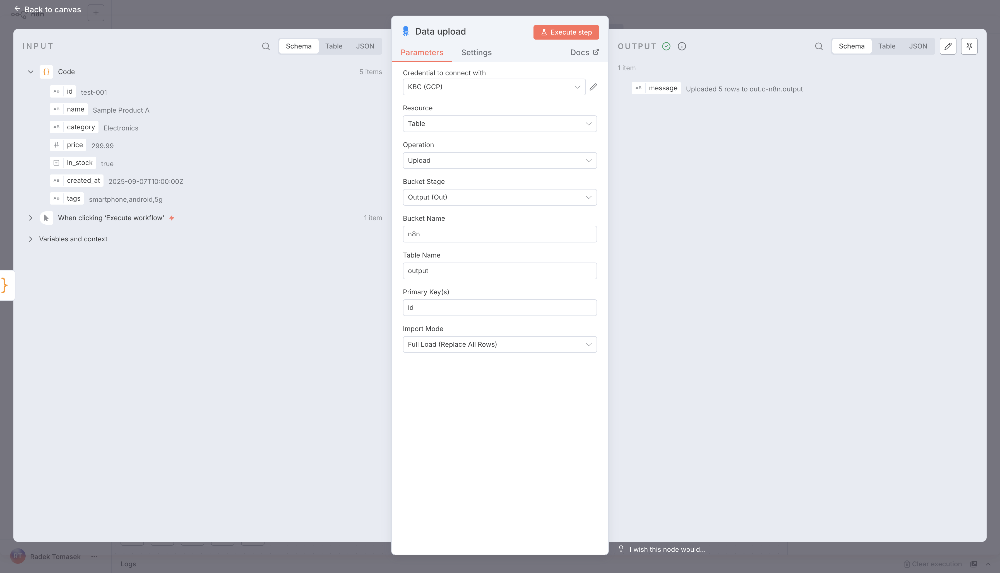
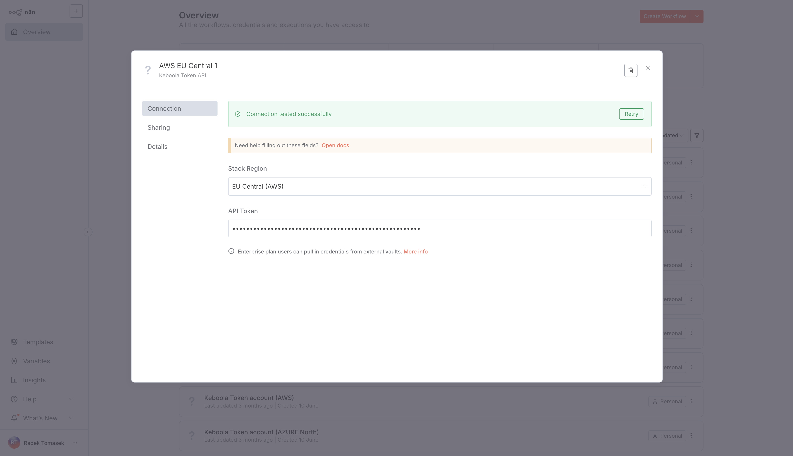
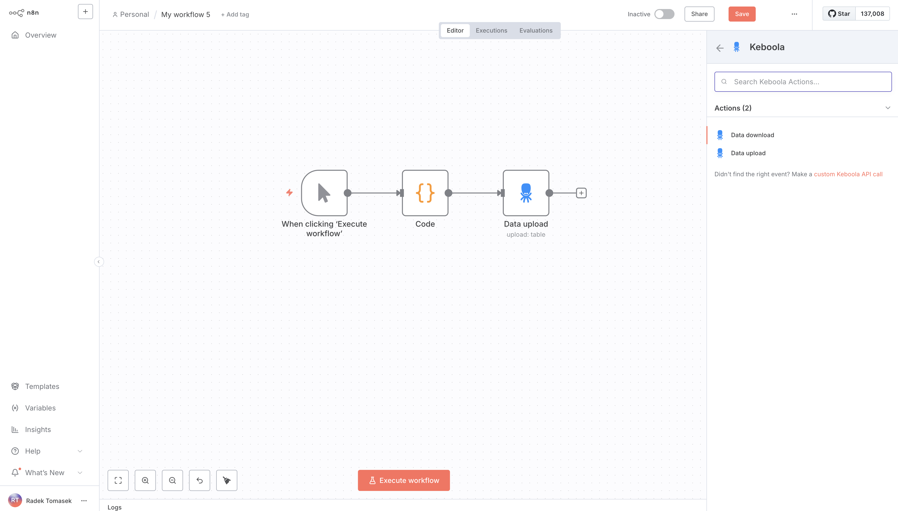

# n8n Nodes – Keboola Integration

This is an n8n community node that integrates Keboola with your n8n workflows, so you can automate data pipelines, upload and download tables, and connect Keboola to hundreds of other services through n8n.

[Keboola](https://keboola.com) is a data platform for building and running data pipelines, while [n8n](https://n8n.io) is a fair-code licensed workflow automation tool. Together, they allow you to orchestrate data flows end-to-end with minimal effort.

## Table of Contents

- [Installation (self-hosted)](#installation-self-hosted)
- [Installation for development and contributing](#installation-for-development-and-contributing)
- [Operations](#operations)
- [Credentials](#credentials)
- [Compatibility](#compatibility)
- [Usage](#usage)
- [Resources](#resources)
- [Release](#release)
- [Version History](#version-history)
- [Troubleshooting](#troubleshooting)

## Installation (self-hosted)

To install the Keboola community node directly from the n8n Editor UI:

1. Open your n8n instance.
2. Go to **Settings → Community Nodes**.
3. Select **Install a community node**.
4. Enter the npm package name: `@keboola/n8n-nodes-keboola`
5. Accept the community node disclaimer and confirm installation.



The Keboola node is now available in your workflows.

## Installation for development and contributing

If you want to contribute to this project, you can link the node to your local n8n instance.

### Prerequisites

- [Node.js](https://nodejs.org/en/download) (recommended v20+)

### Steps

1. **Initialize n8n locally** 

Install and start n8n (if not already installed): 

```bash
npm install -g n8n
n8n start
```

This will create the `~/.n8n` directory.

2. **Clone and build the node**

```bash
git clone git@github.com:keboola/n8n-nodes-keboola.git # or https://github.com/keboola/n8n-nodes-keboola.git
cd n8n-nodes-keboola
npm install
npm run build
```

3. **Link the custom node to n8n**

```bash
mkdir -p ~/.n8n/custom
ln -s /full/path/to/n8n-nodes-keboola ~/.n8n/custom/n8n-nodes-keboola
```

4. **Restart n8n**

```bash
n8n start
```

5. **Making changes**

If you modify the node, rebuild and restart:

```bash
pnpm run build
n8n start
```

## Operations

The Keboola node currently supports three types of operations:

- **Data download**

Extracts data from a Keboola table into your n8n workflow.
	- Parameters: Credential, Table ID
	


- **Data upload**

Uploads data from your workflow into a Keboola table.
	- Parameters: Bucket Stage, Bucket Name, Table Name, Primary Key(s), Import Mode
	


- **Custom API Call**

For advanced use cases, you can call any Keboola Storage API endpoint directly.

## Credentials

The node uses **API Key authentication**.

When creating a credential in n8n, select your Keboola stack region:

- US Default (AWS): `https://connection.keboola.com`
- EU Central (AWS): `https://connection.eu-central-1.keboola.com`
- EU North (Azure): `https://connection.north-europe.azure.keboola.com`
- US East (GCP): `https://connection.us-east4.gcp.keboola.com`



Then provide your **Keboola Storage API Token** (create under Project Settings → API Tokens in Keboola).

## Compatibility

This node has been tested with n8n version **1.57.0** and newer.

## Usage

1. Create a new workflow in n8n.
2. Add the **Keboola node**.
3. Select an operation:
	- **Data download** to pull a table.
	- **Data upload** to write into Keboola.
	- **Custom API Call** for advanced use.
4. Configure the parameters.
5. Connect with other nodes (e.g., Google Sheets, Slack, HTTP).
6. Execute the workflow.



## Resources

- [Keboola API Documentation](https://developers.keboola.com/overview/api)
- [n8n Documentation](https://docs.n8n.io)
- [n8n Community Nodes Guide](https://docs.n8n.io/integrations/#community-nodes)
- [n8n Keboola Documentation](https://help.keboola.com/external-integrations/n8n)
- [NPM Package](https://www.npmjs.com/package/@keboola/n8n-nodes-keboola)
- [GitHub Repository](https://github.com/keboola/n8n-nodes-keboola)

## Release

This project uses GitHub Actions to publish releases to npm. To create a release:

1. Ensure `main` is up to date.
2. Bump the version in `package.json` according to [semver](https://semver.org).
3. Commit and push.
4. Create a GitHub Release with the new version tag (e.g., `v1.0.0`).

The CI workflow will build, test, and publish automatically.

## Version History

See [Releases](https://github.com/keboola/n8n-nodes-keboola/releases).

## Troubleshooting

- **Authentication errors**: Verify your API token and stack region are correct.
- **Operation errors**: Double-check bucket names, table IDs, or job IDs.
- **Node not available**: Confirm the Keboola node is installed from the Community Nodes registry. Currently only self-hosted n8n is supported.

For additional help, open an issue in this repo or contact [Keboola Support](https://help.keboola.com).
